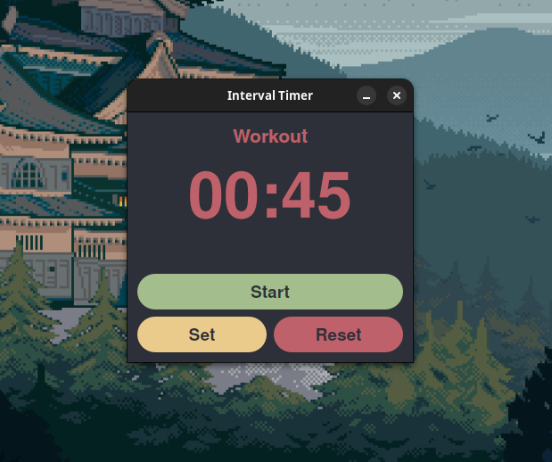

An incredibly simple interval timer, made with ChatGPT's help for personal use. You can install it from the releases using dpkg -i.

# Installation
## for Debian based distributions
  `wget https://github.com/jifuwater/interval_timer_basic/releases/download/release/interval-timer.deb`
  
  `sudo dpkg -i interval-timer.deb`
  
  `rm interval-timer.deb`
# Uninstall
  `sudo apt purge interval-timer`
